# Deploy generative AI models from Amazon SageMaker JumpStart using the AWS CDK

The seeds of a machine learning (ML) paradigm shift have existed for decades, but with the ready availability of virtually infinite compute capacity, a massive proliferation of data, and the rapid advancement of ML technologies, customers across industries are rapidly adopting and using ML technologies to transform their businesses. 

Just recently, generative AI applications have captured everyone’s attention and imagination. We are truly at an exciting inflection point in the widespread adoption of ML, and we believe every customer experience and application will be reinvented with generative AI. 

Generative AI is a type of AI that can create new content and ideas, including conversations, stories, images, videos, and music. Like all AI, generative AI is powered by ML models—very large models that are pre-trained on vast corpora of data and commonly referred to as foundation models (FMs).  

The size and general-purpose nature of FMs make them different from traditional ML models, which typically perform specific tasks, like analyzing text for sentiment, classifying images, and forecasting trends.


With tradition ML models, in order to achieve each specific task, you need to gather labeled data, train a model, and deploy that model. With foundation models, instead of gathering labeled data for each model and training multiple models, you can use the same pre-trained FM to adapt various tasks. You can also customize FMs to perform domain-specific functions that are differentiating to your businesses, using only a small fraction of the data and compute required to train a model from scratch. 

 

Generative AI has the potential to disrupt many industries by revolutionizing the way content is created and consumed. Original content production, code generation, customer service enhancement, and document summarization are typical use cases of generative AI.

 

[Amazon SageMaker JumpStart](https://docs.aws.amazon.com/sagemaker/latest/dg/studio-jumpstart.html) provides pre-trained, open-source models for a wide range of problem types to help you get started with ML. You can incrementally train and tune these models before deployment. JumpStart also provides solution templates that set up infrastructure for common use cases, and executable example notebooks for ML with [Amazon SageMaker](https://aws.amazon.com/sagemaker/).

 

With over 600 pre-trained models available and growing every day, JumpStart enables developers to quickly and easily incorporate cutting-edge ML techniques into their production workflows. You can access the pre-trained models, solution templates, and examples through the JumpStart landing page in [Amazon SageMaker Studio](https://docs.aws.amazon.com/sagemaker/latest/dg/studio.html). You can also access JumpStart models using the SageMaker Python SDK. For information about how to use JumpStart models programmatically, see [Use SageMaker JumpStart Algorithms with Pretrained Models](https://sagemaker.readthedocs.io/en/stable/overview.html#use-sagemaker-jumpstart-algorithms-with-pretrained-models).

 

In April 2023, AWS unveiled [Amazon Bedrock](https://aws.amazon.com/bedrock/), which provides a way to build generative AI-powered apps via pre-trained models from startups including [AI21 Labs](https://www.ai21.com/), [Anthropic](https://techcrunch.com/2023/02/27/anthropic-begins-supplying-its-text-generating-ai-models-to-startups/), and [Stability AI](https://techcrunch.com/2022/10/17/stability-ai-the-startup-behind-stable-diffusion-raises-101m/). Amazon Bedrock also offers access to Titan foundation models, a family of models trained in-house by AWS. With the serverless experience of Amazon Bedrock, you can easily find the right model for your needs, get started quickly, privately customize FMs with your own data, and easily integrate and deploy them into your applications using the AWS tools and capabilities you’re familiar with (including integrations with SageMaker ML features like [Amazon SageMaker Experiments](https://docs.aws.amazon.com/sagemaker/latest/dg/experiments.html) to test different models and [Amazon SageMaker Pipelines](https://aws.amazon.com/sagemaker/pipelines/) to manage your FMs at scale) without having to manage any infrastructure.

 

In this post, we show how to deploy image and text generative AI models from JumpStart using the [AWS Cloud Development Kit](https://aws.amazon.com/cdk/) (AWS CDK). The AWS CDK is an open-source software development framework to define your cloud application resources using familiar programming languages like Python.

 

We use the Stable Diffusion model for image generation and the FLAN-T5-XL model for [natural language understanding (NLU)](https://en.wikipedia.org/wiki/Natural-language_understanding) and text generation from [Hugging Face](https://huggingface.co/) in JumpStart.


## Solution overview

The web application is built on [Streamlit](https://streamlit.io/), an open-source Python library that makes it easy to create and share beautiful, custom web apps for ML and data science. We host the web application using [Amazon Elastic Container Service](https://aws.amazon.com/ecs) (Amazon ECS) with [AWS Fargate](https://docs.aws.amazon.com/AmazonECS/latest/userguide/what-is-fargate.html) and it is accessed via an Application Load Balancer. Fargate is a technology that you can use with Amazon ECS to run [containers](https://aws.amazon.com/what-are-containers) without having to manage servers or clusters or virtual machines. The generative AI model endpoints are launched from JumpStart images in [Amazon Elastic Container Registry](https://aws.amazon.com/ecr/) (Amazon ECR). Model data is stored on [Amazon Simple Storage Service](https://aws.amazon.com/s3/) (Amazon S3) in the JumpStart account. The web application interacts with the models via [Amazon API Gateway](https://aws.amazon.com/api-gateway) and [AWS Lambda](http://aws.amazon.com/lambda) functions as shown in the following diagram.


API Gateway provides the web application and other clients a standard RESTful interface, while shielding the Lambda functions that interface with the model. This simplifies the client application code that consumes the models. The API Gateway endpoints are publicly accessible in this example, allowing for the possibility to extend this architecture to implement different [API access controls](https://docs.aws.amazon.com/apigateway/latest/developerguide/apigateway-control-access-to-api.html) and integrate with other applications.

 

In this post, we walk you through the following steps:

1. Install the [AWS Command Line Interface](http://aws.amazon.com/cli) (AWS CLI) and [AWS CDK v2](https://docs.aws.amazon.com/cdk/v2/guide/getting_started.html) on your local machine.
2. Clone and set up the AWS CDK application.
3. Deploy the AWS CDK application.
4. Use the image generation AI model.
5. Use the text generation AI model.
6. View the deployed resources on the [AWS Management Console](http://aws.amazon.com/console).

We provide an overview of the code in this project in the appendix at the end of this post.


## Prerequisites

You must have the following prerequisites:

- An [AWS account](https://signin.aws.amazon.com/signin)
- The [AWS CLI v2](https://docs.aws.amazon.com/cli/latest/userguide/install-cliv2.html)
- Python 3.6 or later
- node.js 14.x or later
- The [AWS CDK v2](https://docs.aws.amazon.com/cdk/v2/guide/getting_started.html)
- Docker v20.10 or later

 You can deploy the infrastructure in this tutorial from your local computer or you can use [AWS Cloud9](https://aws.amazon.com/cloud9/) as your deployment workstation. AWS Cloud9 comes pre-loaded with AWS CLI, AWS CDK and Docker. If you opt for AWS Cloud9, [create the environment](https://docs.aws.amazon.com/cloud9/latest/user-guide/tutorial-create-environment.html) from the [AWS console](https://console.aws.amazon.com/cloud9).

The estimated cost to complete this post is $50, assuming you leave the resources running for 8 hours. Make sure you delete the resources you create in this post to avoid ongoing charges.


## Install the AWS CLI and AWS CDK on your local machine

If you don’t already have the AWS CLI on your local machine, refer to [Installing or updating the latest version of the AWS CLI](https://docs.aws.amazon.com/cli/latest/userguide/getting-started-install.html) and [Configuring the AWS CLI](https://docs.aws.amazon.com/cli/latest/userguide/cli-chap-configure.html).

Install the AWS CDK Toolkit globally using the following node package manager command:

```
npm install -g aws-cdk-lib@latest
```

Run the following command to verify the correct installation and print the version number of the AWS CDK:

```
cdk --version
```

Make sure you have Docker installed on your local machine. Issue the following command to verify the version:

```
docker --version
```


## Clone and set up the AWS CDK application

On your local machine, clone the AWS CDK application with the following command:

```
git clone https://github.com/aws-samples/generative-ai-sagemaker-cdk-demo.git
```

Navigate to the project folder:

```
cd generative-ai-sagemaker-cdk-demo
```

Before we deploy the application, let's review the directory structure:

```shell
.
├── LICENSE
├── README.md
├── app.py
├── cdk.json
├── code
│   ├── lambda_txt2img
│   │   └── txt2img.py
│   └── lambda_txt2nlu
│       └── txt2nlu.py
├── construct
│   └── sagemaker_endpoint_construct.py
├── images
│   ├── architecture.png
│   ├── ...
├── requirements-dev.txt
├── requirements.txt
├── source.bat
├── stack
│   ├── __init__.py
│   ├── generative_ai_demo_web_stack.py
│   ├── generative_ai_txt2img_sagemaker_stack.py
│   ├── generative_ai_txt2nlu_sagemaker_stack.py
│   └── generative_ai_vpc_network_stack.py
├── tests
│   ├── __init__.py
│   └── ...
└── web-app
    ├── Dockerfile
    ├── Home.py
    ├── configs.py
    ├── img
    │   └── sagemaker.png
    ├── pages
    │   ├── 2_Image_Generation.py
    │   └── 3_Text_Generation.py
    └── requirements.txt
```


The `stack` folder contains the code for each stack in the AWS CDK application. The `code` folder contains the code for the Amazon Lambda functions. The repository also contains the web application located  under the folder `web-app`. 

The `cdk.json` file tells the AWS CDK Toolkit how to run your application.

This application was tested in the `us-east-1` Region but it should work in any Region that has the required services and inference instance type `ml.g4dn.4xlarge` specified in [app.py](app.py). 


#### Setup a virtual environment

This project is set up like a standard Python project. Create a Python virtual environment using the following code:

```
python3 -m venv .venv
```

Use the following command to activate the virtual environment:

```
source .venv/bin/activate
```

If you’re on a Windows platform, activate the virtual environment as follows:

```
.venv\Scripts\activate.bat
```

After the virtual environment is activated, upgrade pip to the latest version:

```
python3 -m pip install --upgrade pip
```

Install the required dependencies:

```
pip install -r requirements.txt
```

Before you deploy any AWS CDK application, you need to bootstrap a space in your account and the Region you’re deploying into. To bootstrap in your default Region, issue the following command:

```
cdk bootstrap
```

If you want to deploy into a specific account and Region, issue the following command:

```
cdk bootstrap aws://ACCOUNT-NUMBER/REGION
```

For more information about this setup, visit  [Getting started with the AWS CDK](https://docs.aws.amazon.com/cdk/latest/guide/getting_started.html).


#### AWS CDK application stack structure

The AWS CDK application contains multiple stacks as shown in the following diagram.

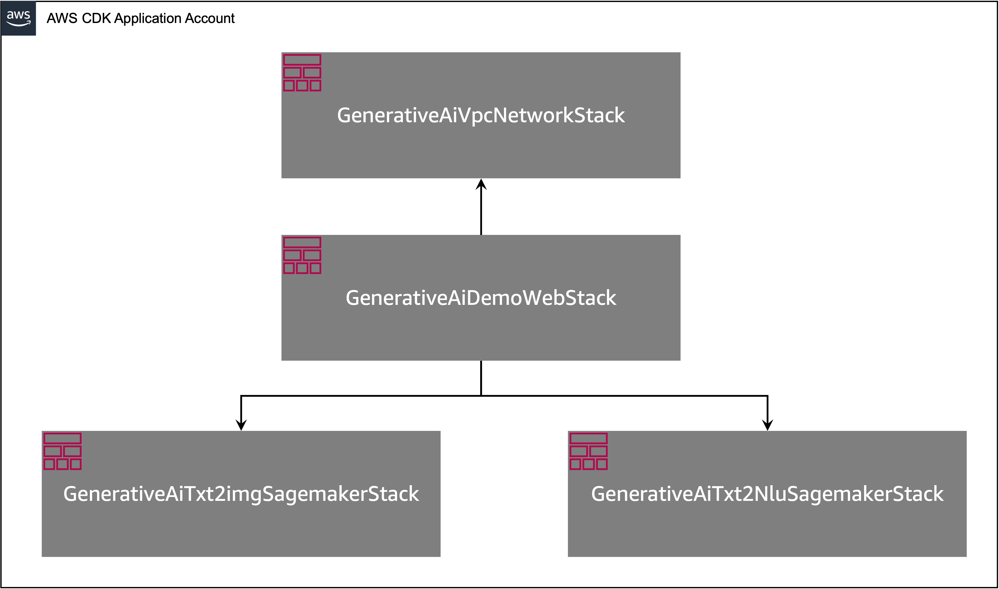

You can list stacks in your CDK application with the following command:

```bash
cdk list
```
You should get the following output:

```
GenerativeAiTxt2imgSagemakerStack
GenerativeAiTxt2nluSagemakerStack
GenerativeAiVpcNetworkStack
GenerativeAiDemoWebStack
```


Other useful AWS CDK commands:

 * `cdk ls`     - Lists all stacks in the app
 * `cdk synth`    - Emits the synthesized AWS CloudFormation template
 * `cdk deploy`    - Deploys this stack to your default AWS account and Region
 * `cdk diff`     - Compares the deployed stack with current state
 * `cdk docs`     - Opens the AWS CDK documentation

The next section shows you how to deploy the AWS CDK application.


## Deploy the AWS CDK application

The AWS CDK application will be deployed to the default Region based on your workstation configuration. If you want to force the deployment in a specific Region, set your `AWS_DEFAULT_REGION` environment variable accordingly.


At this point, you can deploy the AWS CDK application. First you launch the VPC network stack:

```
cdk deploy GenerativeAiVpcNetworkStack
```

If you are prompted, enter `y` to proceed with the deployment. You should see a list of AWS resources that are being provisioned in the stack. This step takes around 3 minutes to complete.


Then you  launch the web application stack:

```
cdk deploy GenerativeAiDemoWebStack
```

After analyzing the stack, the AWS CDK will display the resource list in the stack. Enter y to proceed with the deployment. This step takes around 5 minutes.

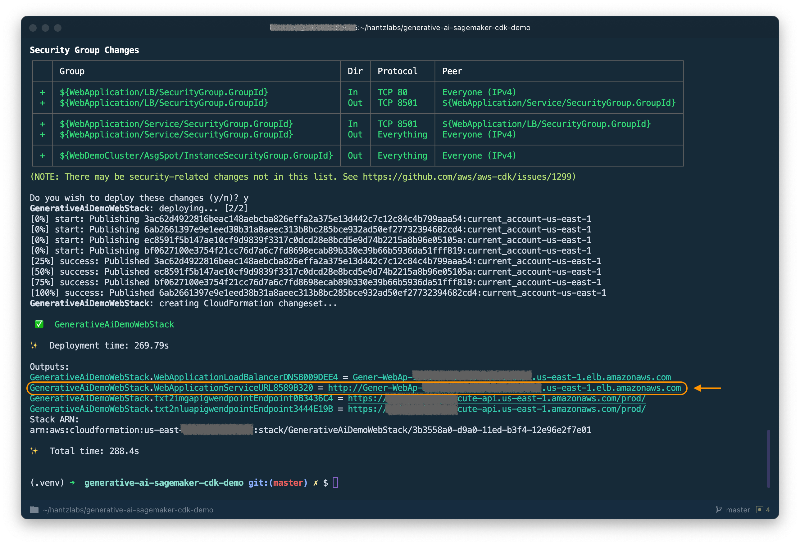

Note down the `WebApplicationServiceURL` from the output as you will use it later. You can also retrieve it later in the CloudFormation console, under the `GenerativeAiDemoWebStack` stack outputs.


Now, launch the image generation AI model endpoint stack:

```
cdk deploy GenerativeAiTxt2imgSagemakerStack
```

This step takes around 8 minutes. The image generation model endpoint is deployed, we can now use it.


## Use the image generation AI model

The first example demonstrates how to utilize Stable Diffusion, a powerful generative modeling technique that enables the creation of high-quality images from text prompts.

1. Access the web application using the `WebApplicationServiceURL` from the output of the `GenerativeAiDemoWebStack` in your browser.

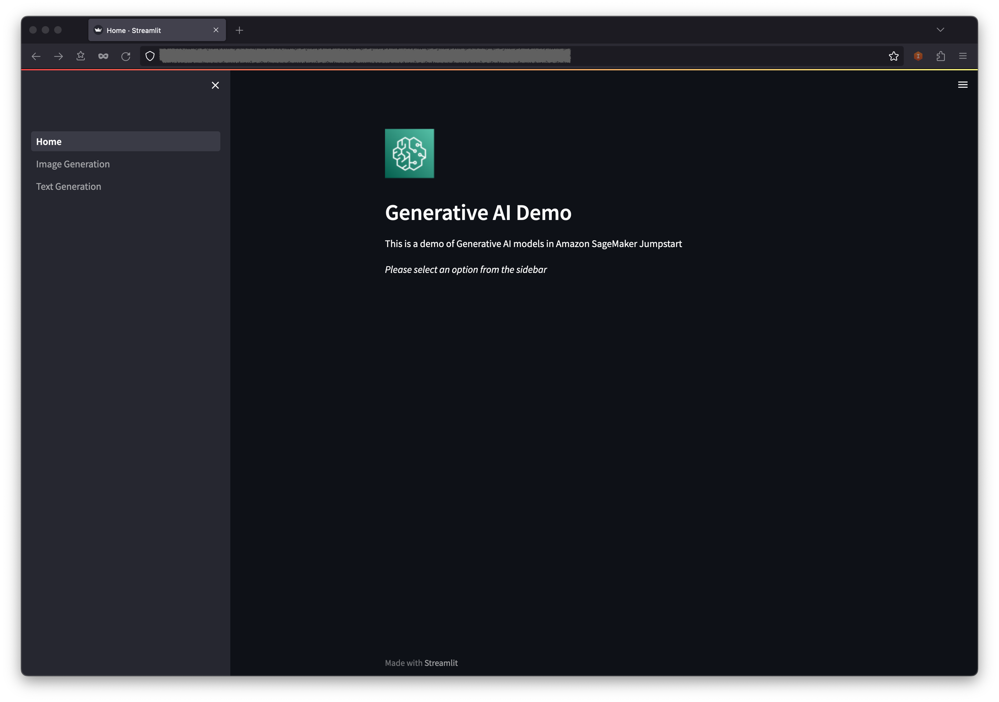

2. In the navigation pane, choose **Image Generation**.

3. The **SageMaker Endpoint Name** and **API GW Url** fields will be pre-populated, but you can change the prompt for the image description if you’d like. 
4. Choose **Generate image**.

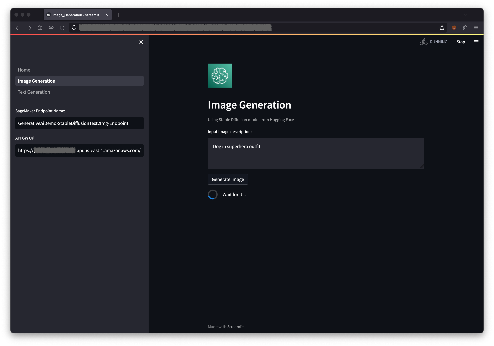

The application will make a call to the SageMaker endpoint. It takes a few seconds. A picture with the charasteristics in your image description will be displayed.

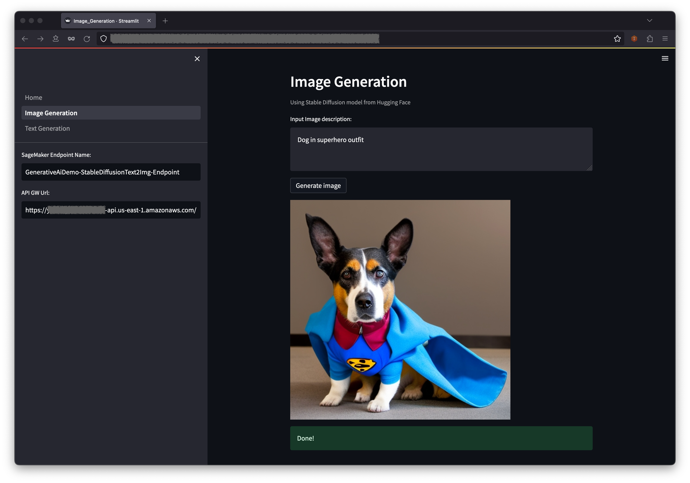


## Use the text generation AI model

The second example centers around using the FLAN-T5-XL model, which is a foundation or large language model (LLM), to achieve in-context learning for text generation while also addressing a broad range of natural language understanding (NLU) and natural language generation (NLG) tasks. 

Some environments might limit the number of endpoints you can launch at a time. If this is the case, you can launch one SageMaker endpoint at a time. To stop a SageMaker endpoint in the AWS CDK app, you have to destroy the deployed endpoint stack and before launching the other endpoint stack. To turn down the image generation AI model endpoint, issue the following command:

```
cdk destroy GenerativeAiTxt2imgSagemakerStack
```


Then launch the text generation AI model endpoint stack:

```
cdk deploy GenerativeAiTxt2nluSagemakerStack
```

Enter `y` at the prompts. 


After the text generation model endpoint stack is launched, complete the following steps:

1. Go back to the web application and choose **Text Generation** in the navigation pane.
2. The **Input Context** field is pre-populated with a conversation between a customer and an agent regarding an issue with the customers phone, but you can enter your own context if you’d like.

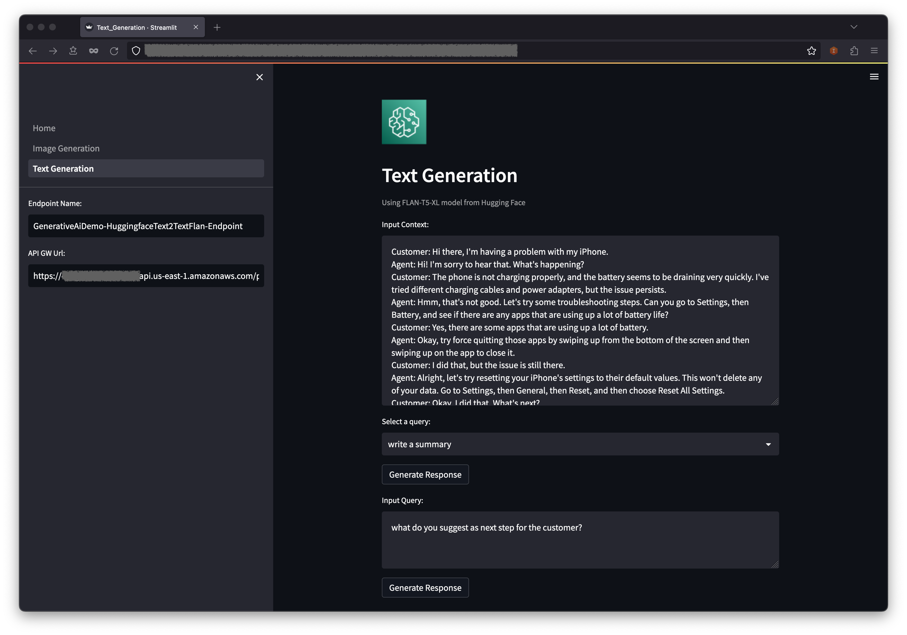

Below the context, you will find some prepopulated queries in the dropdown menu options. 

3. Choose a query and choose **Generate Response**.

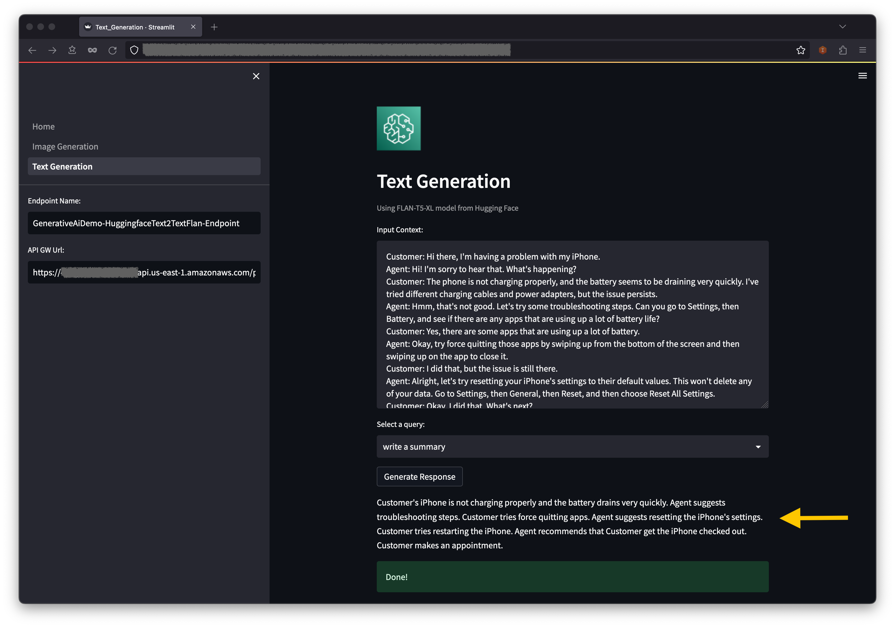

You can also enter your own query in the **Input Query** field and choose **Generate Response**.

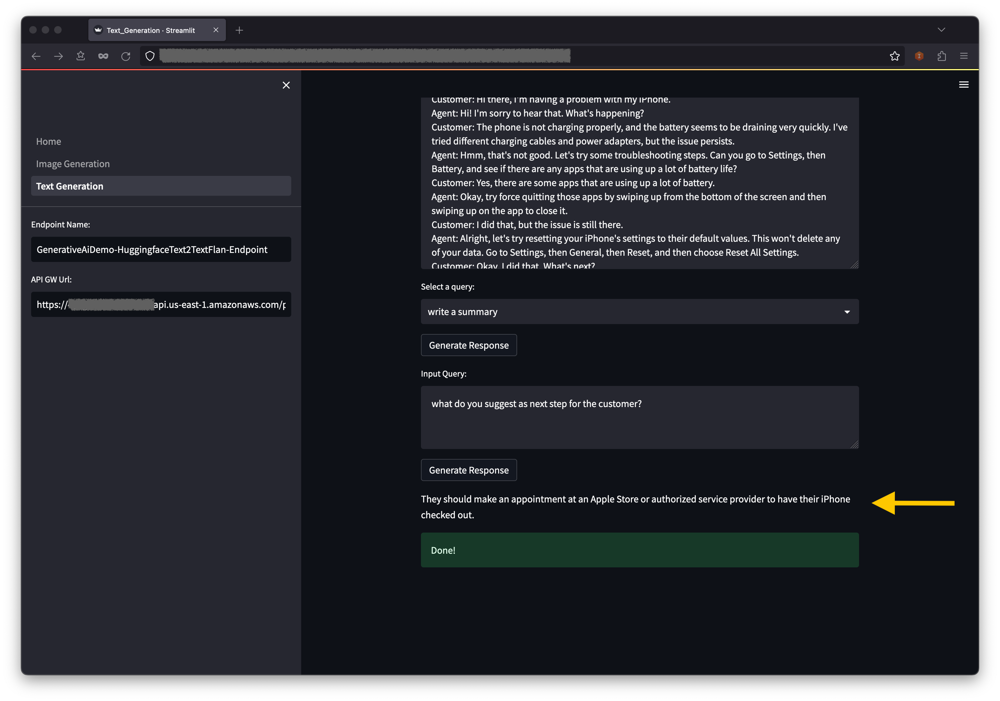


## View the deployed resources on the console

On the AWS CloudFormation console, choose **Stacks** in the navigation pane to view the stacks deployed.


On the Amazon ECS console, you can see the clusters on the **Clusters** page.

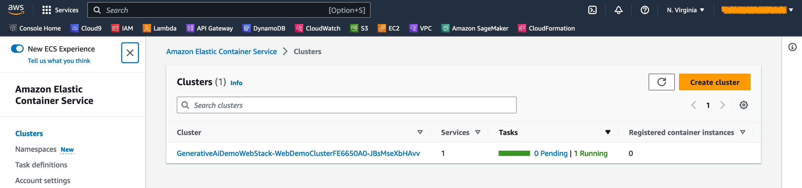


On the AWS Lambda console, you can see the functions on the **Functions** page.

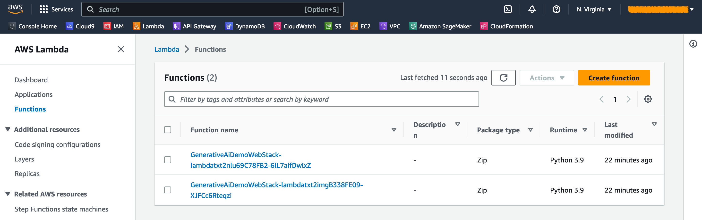


On the API Gateway console, you can see the API Gateway endpoints on the **APIs** page.

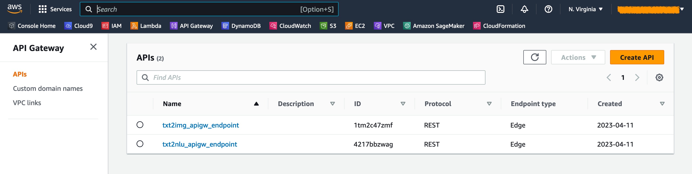


On the SageMaker console, you can see the deployed model endpoints on the **Endpoints** page.

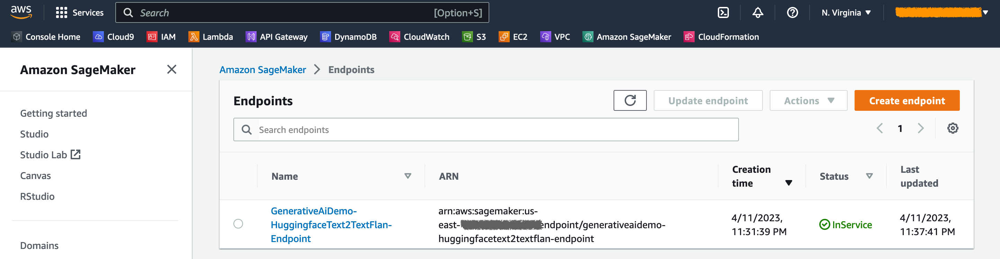


When the stacks are launched, some parameters are generated. These are stored in the [AWS Systems Manager Parameter Store](https://docs.aws.amazon.com/systems-manager/latest/userguide/systems-manager-parameter-store.html). To view them, choose **Parameter Store** in the navigation pane on the [AWS Systems Manager](https://aws.amazon.com/systems-manager/) console.

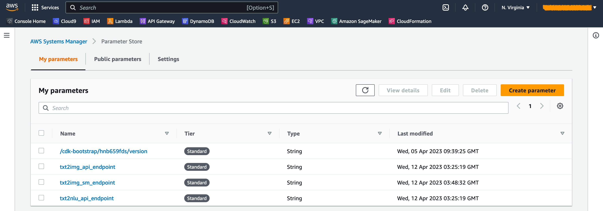


## Clean up

To avoid unnecessary cost, clean up all the infrastructure created with the following command on your workstation:

```
cdk destroy --all
```

Enter `y` at the prompt. This step takes around 10 minutes. Check if all resources are deleted on the console. Also delete the assets S3 buckets created by the AWS CDK on the Amazon S3 console as well as the assets repositories on Amazon ECR.


## Conclusion

As demonstrated in this post, you can use the AWS CDK to deploy generative AI models in JumpStart. We showed an image generation example and a text generation example using a user interface powered by Streamlit, Lambda, and API Gateway.

You can now build your generative AI projects using pre-trained AI models in JumpStart. You can also extend this project to fine-tune the foundation models for your use case and control access to API Gateway endpoints. 

We invite you to test the solution and contribute to the project on [GitHub](https://github.com/aws-samples/generative-ai-sagemaker-cdk-demo).


## License summary

This sample code is made available under a modified MIT license. See the [LICENSE](https://github.com/Hantzley/generative-ai-sagemaker-cdk-demo/blob/main/LICENSE) file for more information. Also, review the respective licenses for the [stable diffusion](https://huggingface.co/stabilityai/stable-diffusion-2-1-base) and [flan-t5-xl](https://huggingface.co/google/flan-t5-xl) models on Hugging Face.


## About Authors

**Hantzley Tauckoor** is an APJ Partner Solutions Architecture Leader based in  Singapore. He has 20 years’ experience in the ICT industry spanning multiple  functional areas, including solutions architecture, business development,  sales strategy, consulting, and leadership. He leads a team of Senior  Solutions Architects that enable partners to develop joint solutions, build  technical capabilities, and steer them through the implementation phase as  customers migrate and modernize their applications to AWS. Outside work, he  enjoys spending time with his family, watching movies, and hiking.  


**Kwonyul Choi** is a CTO at BABITALK, a Korean beauty care platform startup, based in Seoul. Prior to this role, Kownyul worked as Software Development Engineer at AWS with a focus on AWS CDK and Amazon SageMaker.


**Arunprasath Shankar** is a Senior AI/ML Specialist Solutions Architect with AWS, helping global customers scale their AI solutions effectively and efficiently in the cloud. In his spare time, Arun enjoys watching sci-fi movies and listening to classical music.


**Satish Upreti** is a Migration Lead PSA and Security SME in the partner  organization in APJ. Satish has 20 years of experience spanning on-premises  private cloud and public cloud technologies. Since joining AWS in August 2020  as a migration specialist, he provides extensive technical advice and support  to AWS partners to plan and implement complex migrations.  


## Appendix: Code walk-through

In this section, we provide an overview of the code in this project. 


**AWS CDK Application**

The main AWS CDK application is contained in the `app.py` file in the root directory. The project consists of multiple stacks, so we have to import the stacks:

```python
#!/usr/bin/env python3
import aws_cdk as cdk

from stack.generative_ai_vpc_network_stack import GenerativeAiVpcNetworkStack
from stack.generative_ai_demo_web_stack import GenerativeAiDemoWebStack
from stack.generative_ai_txt2nlu_sagemaker_stack import GenerativeAiTxt2nluSagemakerStack
from stack.generative_ai_txt2img_sagemaker_stack import GenerativeAiTxt2imgSagemakerStack

```


We define our generative AI models and get the related URIs from SageMaker:

```python
from script.sagemaker_uri import *
import boto3

region_name = boto3.Session().region_name
env={"region": region_name}

#Text to Image model parameters
TXT2IMG_MODEL_ID = "model-txt2img-stabilityai-stable-diffusion-v2-1-base"
TXT2IMG_INFERENCE_INSTANCE_TYPE = "ml.g4dn.4xlarge" 
TXT2IMG_MODEL_TASK_TYPE = "txt2img"
TXT2IMG_MODEL_INFO = get_sagemaker_uris(model_id=TXT2IMG_MODEL_ID,
                                        model_task_type=TXT2IMG_MODEL_TASK_TYPE, 
                                        instance_type=TXT2IMG_INFERENCE_INSTANCE_TYPE,
                                        region_name=region_name)

#Text to NLU image model parameters
TXT2NLU_MODEL_ID = "huggingface-text2text-flan-t5-xl"
TXT2NLU_INFERENCE_INSTANCE_TYPE = "ml.g4dn.4xlarge" 
TXT2NLU_MODEL_TASK_TYPE = "text2text"
TXT2NLU_MODEL_INFO = get_sagemaker_uris(model_id=TXT2NLU_MODEL_ID,
                                        model_task_type=TXT2NLU_MODEL_TASK_TYPE,
                                        instance_type=TXT2NLU_INFERENCE_INSTANCE_TYPE,
                                        region_name=region_name)
```


The function `get_sagemaker_uris` retrieves all the model information from Amazon  JumpStart. See [script/sagemaker_uri.py](./script/sagemaker_uri.py).


Then, we instantiate the stacks:

```python
app = cdk.App()

network_stack = GenerativeAiVpcNetworkStack(app, "GenerativeAiVpcNetworkStack", env=env)
GenerativeAiDemoWebStack(app, "GenerativeAiDemoWebStack", vpc=network_stack.vpc, env=env)

GenerativeAiTxt2nluSagemakerStack(app, "GenerativeAiTxt2nluSagemakerStack", env=env, model_info=TXT2NLU_MODEL_INFO)
GenerativeAiTxt2imgSagemakerStack(app, "GenerativeAiTxt2imgSagemakerStack", env=env, model_info=TXT2IMG_MODEL_INFO)

app.synth()
```

The first stack to launch is the VPC stack, `GenerativeAiVpcNetworkStack`. The web application stack, `GenerativeAiDemoWebStack`, is dependent on the VPC stack. The dependency is done through parameter passing `vpc=network_stack.vpc`.

See [app.py](./app.py) for the full code.


**VPC network stack**

In the `GenerativeAiVpcNetworkStack` stack we create a VPC with a public subnet and a private subnet spanning across two Availability Zones (AZs):

```python
        self.output_vpc = ec2.Vpc(self, "VPC",
            nat_gateways=1,
            ip_addresses=ec2.IpAddresses.cidr("10.0.0.0/16"),
            max_azs=2,
            subnet_configuration=[
                ec2.SubnetConfiguration(name="public",subnet_type=ec2.SubnetType.PUBLIC,cidr_mask=24),
                ec2.SubnetConfiguration(name="private",subnet_type=ec2.SubnetType.PRIVATE_WITH_EGRESS,cidr_mask=24)
            ]
        )
```

See  [/stack/generative_ai_vpc_network_stack.py](./stack/generative_ai_vpc_network_stack.py) for the full code.


**Demo web application stack**

In the `GenerativeAiDemoWebStack` stack we launch  Lambda functions and respective Amazon API Gateway endpoints through which the web application interacts with the SageMaker model endpoints. See the following code snippet:

```python
        # Defines an AWS Lambda function for Image Generation service
        lambda_txt2img = _lambda.Function(
            self, "lambda_txt2img",
            runtime=_lambda.Runtime.PYTHON_3_9,
            code=_lambda.Code.from_asset("code/lambda_txt2img"),
            handler="txt2img.lambda_handler",
            role=role,
            timeout=Duration.seconds(180),
            memory_size=512,
            vpc_subnets=ec2.SubnetSelection(
                subnet_type=ec2.SubnetType.PRIVATE_WITH_EGRESS
            ),
            vpc=vpc
        )
        
        # Defines an Amazon API Gateway endpoint for Image Generation service
        txt2img_apigw_endpoint = apigw.LambdaRestApi(
            self, "txt2img_apigw_endpoint",
            handler=lambda_txt2img
        )
```


The web application is containerized and hosted on [Amazon ECS with Fargate](https://docs.aws.amazon.com/AmazonECS/latest/userguide/what-is-fargate.html). See the following code snippet:

```python
        # Create Fargate service
        fargate_service = ecs_patterns.ApplicationLoadBalancedFargateService(
            self, "WebApplication",
            cluster=cluster,            # Required
            cpu=2048,                   # Default is 256 (512 is 0.5 vCPU, 2048 is 2 vCPU)
            desired_count=1,            # Default is 1
            task_image_options=ecs_patterns.ApplicationLoadBalancedTaskImageOptions(
                image=image, 
                container_port=8501,
                ),
            #load_balancer_name="gen-ai-demo",
            memory_limit_mib=4096,      # Default is 512
            public_load_balancer=True)  # Default is True
```

See [/stack/generative_ai_demo_web_stack.py](./stack/generative_ai_demo_web_stack.py) for the full code.


**Image generation SageMaker model endpoint stack**

The `GenerativeAiTxt2imgSagemakerStack` stack creates the image generation model endpoint from SageMaker JumpStart and stores the endpoint name in [AWS Systems Manager Parameter Store](https://docs.aws.amazon.com/systems-manager/latest/userguide/systems-manager-parameter-store.html). This parameter will be used by the web application. See the following code:

```python
        endpoint = SageMakerEndpointConstruct(self, "TXT2IMG",
                                    project_prefix = "GenerativeAiDemo",
                                    
                                    role_arn= role.role_arn,

                                    model_name = "StableDiffusionText2Img",
                                    model_bucket_name = model_info["model_bucket_name"],
                                    model_bucket_key = model_info["model_bucket_key"],
                                    model_docker_image = model_info["model_docker_image"],

                                    variant_name = "AllTraffic",
                                    variant_weight = 1,
                                    instance_count = 1,
                                    instance_type = model_info["instance_type"],

                                    environment = {
                                        "MMS_MAX_RESPONSE_SIZE": "20000000",
                                        "SAGEMAKER_CONTAINER_LOG_LEVEL": "20",
                                        "SAGEMAKER_PROGRAM": "inference.py",
                                        "SAGEMAKER_REGION": model_info["region_name"],
                                        "SAGEMAKER_SUBMIT_DIRECTORY": "/opt/ml/model/code",
                                    },

                                    deploy_enable = True
        )
        
        ssm.StringParameter(self, "txt2img_sm_endpoint", parameter_name="txt2img_sm_endpoint", string_value=endpoint.endpoint_name)
```

See [/stack/generative_ai_txt2img_sagemaker_stack.py](./stack/generative_ai_txt2img_sagemaker_stack.py) for the full code.


**NLU and text generation SageMaker model endpoint stack**

The `GenerativeAiTxt2nluSagemakerStack` stack creates the NLU and text generation model endpoint from JumpStart and stores the endpoint name in Systems Manager Parameter Store. This parameter will also be used by the web application. See the following code:

```python
        endpoint = SageMakerEndpointConstruct(self, "TXT2NLU",
                                    project_prefix = "GenerativeAiDemo",
                                    
                                    role_arn= role.role_arn,

                                    model_name = "HuggingfaceText2TextFlan",
                                    model_bucket_name = model_info["model_bucket_name"],
                                    model_bucket_key = model_info["model_bucket_key"],
                                    model_docker_image = model_info["model_docker_image"],

                                    variant_name = "AllTraffic",
                                    variant_weight = 1,
                                    instance_count = 1,
                                    instance_type = model_info["instance_type"],

                                    environment = {
                                        "MODEL_CACHE_ROOT": "/opt/ml/model",
                                        "SAGEMAKER_ENV": "1",
                                        "SAGEMAKER_MODEL_SERVER_TIMEOUT": "3600",
                                        "SAGEMAKER_MODEL_SERVER_WORKERS": "1",
                                        "SAGEMAKER_PROGRAM": "inference.py",
                                        "SAGEMAKER_SUBMIT_DIRECTORY": "/opt/ml/model/code/",
                                        "TS_DEFAULT_WORKERS_PER_MODEL": "1"
                                    },

                                    deploy_enable = True
        )
        
        ssm.StringParameter(self, "txt2nlu_sm_endpoint", parameter_name="txt2nlu_sm_endpoint", string_value=endpoint.endpoint_name)
```

See [/stack/generative_ai_txt2nlu_sagemaker_stack.py](./stack/generative_ai_txt2nlu_sagemaker_stack.py) for the full code.


**The Web application**

The web application is located in the [/web-app](./web-app) directory. It is a Streamlit application that is containerized as per the [Dockerfile](./web-app/Dockerfile):

```dockerfile
FROM --platform=linux/x86_64 python:3.9
EXPOSE 8501
WORKDIR /app
COPY requirements.txt ./requirements.txt
RUN pip3 install -r requirements.txt
COPY . .
CMD streamlit run Home.py \
    --server.headless true \
    --browser.serverAddress="0.0.0.0" \
    --server.enableCORS false \
    --browser.gatherUsageStats false
```

To learn more about Streamlit, see [Streamlit documentation](https://docs.streamlit.io/).

